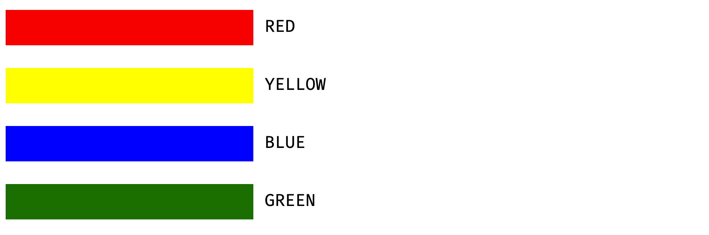
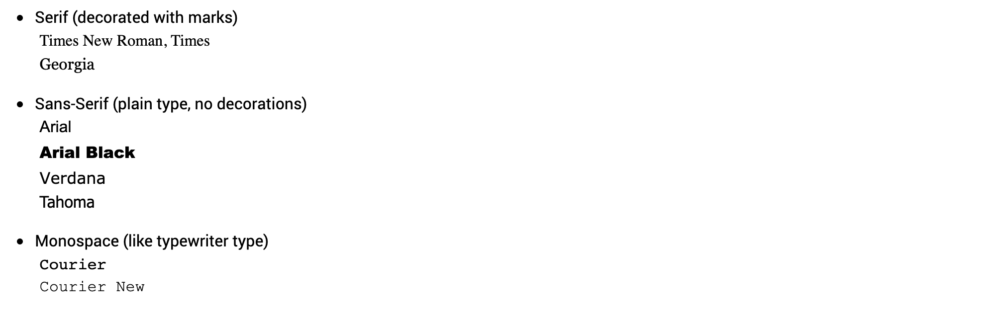

### Fonts and Text Styling
After any length of time on the Internet, you’ll notice that a web page is made up of more than just plain words on a screen. There are headlines, paragraphs, graphics, colors and much more. It’s a lively place to be. HTML defines special elements for defining text with a special meaning. Formatting elements are designed to display special types of text. Examples of formatting elements are:

| Element                  | Description                        |
| -------                  | -----------                        |
| <b>...</b>               | Defines bold text                  |
| <i>...</i>               | Defines italic text                |
| <p>...</p>               | Begin a new paragraph              |
| <mark>...</mark>         | Defines marked/highlighted text    |
|                          | It is called the headline tag.     |
| <h1>…</h1> to <h6>…</h6> | It creates a bold copy             |
| <sub>...</sub>           |  Defines subscripted text          |

### Formating Text to different colors
In HTML, a color can be specified by using a color name, an **RGB** value, or a **HEX** value.

<ul>
  <li>By Color name
    > A color name is specified.
  </li>
</ul>



<ul>
  <li>By an RGB value
    > A color can also be specified as an RGB value, using this formula: rgb(red, green, blue). Each parameter (red, green, and blue) defines the intensity of the color between 0 and 255. For example, rgb(255,0,0) is displayed as red, because red is set to its highest value (255) and the others are set to 0. You can experiment by mixing the RGB values.
  </li>
</ul>

<ul>
  <li>By an HEX value
    > A color can also be specified using a hexadecimal value in the form: #RRGGBB, where RR (red), GG (green) and BB (blue) are hexadecimal values between 00 and FF (same as decimal 0-255). For example, #FF0000 is displayed as red, because red is set to its highest value (FF) and the others are set to the lowest value (00).
  </li>
</ul>

### Formating Text to different fonts
Every computer comes loaded with several fonts.  If you don’t use the font style that is on the end user’s system, the browser will automatically go with the default of Times New Roman. To prevent this occurrence, include more than one font name. For instance, more font family choices was added to be on the safe side.

```html
<h1 style="font-family:Arial,Helvetica,sans-serif;">Formatting Text</h1>
```

Here is a list of fonts that are a safe bet:




### Formating Text to Different Font Sizes
Font sizes in HTML are commonly referenced in **pixels(px)**, **percent(%)** or **point(pt)**. 

Note that, the Font Element and it’s Attributes have been Deprecated in HTML5. The Style attribute has been adopted.

### Styling Text
As with all attributes discussed so far, The Style attribute must appear in the opening tag of the element. The style property include;background-color, color, font-family, font-size, text-align. 

The HTML style attribute has the following syntax:

```html
<tagName style="property:value;"> </tagName>

<h1 style=”color:red;”>This headline</h1>
```

```
The line of code above is tells the browser to make the word ”This headline” a first level headline (<h1>, the largest) and in red.
```

The style attribute to select a font I want, like Arial. Here’s the code:

```html
<h1 style="color: red;">Headline One</h1>
<h1 style="font-family: Aria;">Headline One</h1>
```

The above can be written on a line by combining the color and font-family, like this:

```html
<h1 style="color: blue; font-family:Arial;"> Headline Two</h1>
```

Notice the color and font-family are inside the quotes and separated by a semi-colon (;).

### Style Syntax
Remember that all those punctuation marks are important when you are writing your code. In the Style attribute, you have to remember:

<ul>
  <li>the equal sign after the word style (=)</li>
  <li>to include your value (color, size, etc) in quotation marks (“),</li>
  <li>to separate each command with  semi-colons (;),</li>
  <li>to end the opening tag with an angled bracket (>).</li>
</ul>