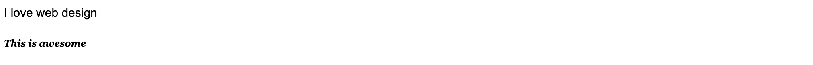
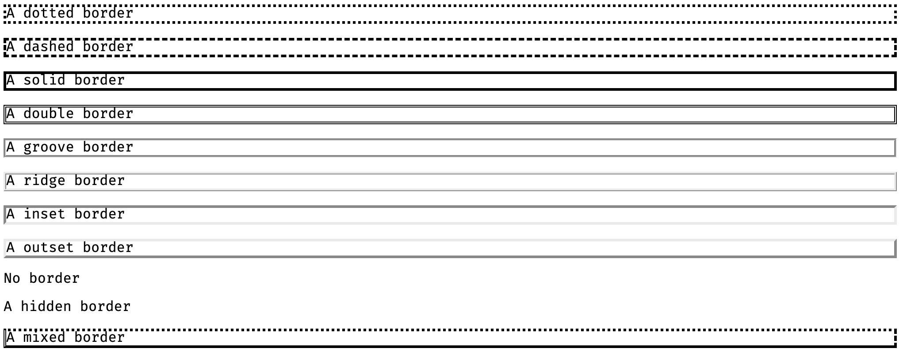

# Introduction to CSS
CSS stands for Cascading Style Sheets. It describes how HTML elements are to be displayed. There are three ways to “style” with CSS:

* Inline
  > An inline CSS is used to apply a unique style to a single HTML element. It uses the style attribute of an HTML element. An Example:

```html
<h1 style="color: blue;">This is a Blue Heading</h1>
```

* Internal
  > An internal CSS is used to define a style for a single HTML page. You list all your formatting by using the **style** element and placing it in the **head** section of the code.
  Example:

```html
<!DOCTYPE html>
<html>
  <head>
    <style>
      body { background-color: powderblue; }
      h1   { color: blue; }
      p    { color: red; }
    </style>
  </head>
  <body>
    <h1>This is a heading</h1>
    <p>This is a paragraph.</p>
  </body>
</html>
```

* External
  > An external style sheet is used to define the style for many HTML pages. With an external style sheet, you can change the look of an entire web site, by changing one file. To use an external style sheet, add a **link** to it in the **head** section of the HTML page.
  Example

```html
<!DOCTYPE html>
<html>
  <head>
    <link rel="stylesheet" href="styles.css">
  </head>
  <body>
    <h1>This is a heading</h1>
    <p>This is a paragraph.</p>
  </body>
</html>
```

The style.css included in the href attribute looks like this:

```css
body {
	background-color: powderblue;
}
h1 {
	color: blue;
}
p {
	color: red;
}
```


### CSS Fonts
The CSS font properties define the font family, font size, and the style of a text.

* **Font Family**
> The font family of a text is set with the font-family property. It should hold several font names as a "fallback" system. If the browser does not support the first font, it tries the next font, and so on. When specifying a font, start with the font you want and end with a generic family, to let the browser pick a similar font in the generic family, if no other fonts are available. 
Example:

```css
p {
	font-family: "Times New Roman", Times, serif;
}
```

* **Font Style**
> The font-style property is mostly used to specify italic text. This property has three values:

<ul>
  <li>normal - The text is shown normally</li>
  <li>italic - The text is shown in italics</li>
  <li>oblique - The text is "leaning" (oblique is very similar to italic, but less supported)</li>
</ul>

Example

```css
p.normal {
	font-style: normal;
}
p.italic {
	font-style: italic;
}
p.oblique {
	font-style: oblique;
}
```

* **Font Size**
> <p>The <strong style="color: red">font-size</strong> property sets the size of the text. The font-size value can be an absolute, or relative size. An absolute size does not allow a user to change the text size in all browsers but a relative size does.</p>

##### Set Font Size With Pixels
Setting the text size with pixels gives you full control over the text size:

```css
h1 {
	font-size: 40px;
}
```

* **Font Weight**
> The font-weight property specifies the weight of a font:

```css
p.normal {
  font-weight: normal;
}
p.thick {
  font-weight: bold;
}
```

* Font Variant
> <p>The <strong style="color: red">font-variant</strong> property specifies whether or not a text should be displayed in a small-caps font. In a small-caps font, all lowercase letters are converted to uppercase letters. However, the converted uppercase letters appears in a smaller font size than the original uppercase letters in the text.</p>

```css
p.normal {
	font-variant: normal;
}
p.small {
  font-variant: small-caps;
}
```

A demonstration of the CSS font properties in an example:

```html
<!DOCTYPE html>
<html>
  <head>
    <style>
      p.example1{
        font: 15px arial, sans-serif;
      }
      p.example2 {
        font:italic bold 12px/30px Georgia, serif;
      }
    </style>
  </head>
  <body>
    <p class="example1">I love web design </p>
    <p class="example2">This is awesome</p>
  </body>
</html>
```

**Result**


### CSS Border
<p>The CSS <strong style="color: red;">border</strong> properties allow you to specify the style, width, and color of an element's border.</p>

* **Border Style**
> <p>The <strong style="color:red">border-style</strong> property specifies what kind of border to display.</p>

```css
p.dotted { border-style: dotted; }
p.dashed { border-style: dashed; }
p.solid { border-style: solid; }
p.double { border-style: double; }
p.groove { border-style: groove; }
p.ridge { border-style: ridge; }
p.inset { border-style: inset; }
p.outset { border-style: outset; }
p.none { border-style: none; }
p.hidden { border-style: hidden; }
p.mix { border-style: dotted dashed solid double; }
```

**Result**



* **Border Width**
> <p>The <strong style="color: red;">border-width</strong> property specifies the width of the four borders. The border-width property can have from one to four values (for the top border, right border, bottom border, and the left border).
The width can be set as a specific size (in px, pt, cm, em, etc) or by using one of the three pre-defined values: thin, medium, or thick.
</p>
Example:

```css
p {
	border-style: solid;
	border-width: 5px;
}
```

* **Border Color**
> <p>The border-color property is used to set the color of the borders. The color can be set by:</p>

<ul>
  <li>name - specify a color name, like "red"</li>
  <li>Hex - specify a hex value, like "#ff0000"</li>
  <li>RGB - specify a RGB value, like "rgb(255,0,0)"</li>
  <li>transparent</li>
</ul>


### CSS Padding
The CSS padding property defines a padding (space) between the text and the border. The padding clears an area around the content (inside the border) of an element. With CSS, you have full control over the padding. There are CSS properties for setting the padding for each side of an element (top, right, bottom, and left).
Example:

```css
p {
  padding-top: 50px;
  padding-right: 30px;
  padding-bottom: 50px;
  padding-left: 80px;
}
```

All the padding properties can have the following values:

<ul>
  <li>length - specifies a padding in px, pt, cm, etc.</li>
  <li>% - specifies a padding in % of the width of the containing element.</li>
</ul>

### CSS Margin
The CSS margin property defines a margin (space) outside the border. The margin properties set the size of the white space outside the border. With CSS, you have full control over the margins. There are CSS properties for setting the margin for each side of an element (top, right, bottom, and left).
Example:

```css
p {
  margin-top: 100px;
  margin-bottom: 100px;
  margin-right: 150px;
  margin-left: 80px;
}
```

To shorten the code, it is possible to specify all the margin properties in one property.

```css
p {
		margin: 100px 150px 100px 80px;
}
```

All the margin properties can have the following values:

<ul>
  <li>auto - the browser calculates the margin</li>
  <li>length - specifies a margin in px, pt, cm, etc.</li>
  <li>% - specifies a margin in % of the width of the containing element.</li>
</ul>


### Designing Simple Shapes Using HTML and CSS.
With HTML and CSS, simple shapes like squares, circle, rectangles can be created.

### Creating a Circle
First we need a div tag and give it an ID name of the shape. The <div> tag defines a division or a section in an HTML document. The <div> tag is used to group block-elements to format them with CSS. In CSS, there are selectors (id and class). These selectors are included within the tag. The “id” selector is preceded with an (#) and the “class” selector is preceded with a full-stop (.) So for this example, set circle as the ID name.

```html
<div id="circle"></div>
```


For the CSS, simply put a width and height and then give it a border radius half of the width and height.

```css
#circle {
  width: 120px;
  height: 120px;
  background: #7fee1d;
  -moz-border-radius: 60px;
  -webkit-border-radius: 60px;
  border-radius: 60px;
}
```

### Creating a Square
To create a square shape in CSS, just like the circle shape , we need a div and give it an ID name of the shape. So, for this example, set square as the ID name.

```html
<div id="square"></div>
```

For the CSS , simply set up a width and height of equal value and provide a value making it look visible

```css
#square {
  width: 120px;
  height: 120px;
  background: #f447ff;
}
```

### Create a CSS Rectangle
To create a rectangular CSS shape, just like the square shape, set-up a div with the ID name rectangle.

```html
<div id="rectangle"></div>
```

Just like the square shape, we will put a simple width but this time larger than the height.

```css
#rectangle {
  width: 220px;
  height: 120px;
  background: #4da1f7;
}
```

### Take Home Assignment
* Create a web page containing the basic shapes.
* Create a beautiful blog page using HTML and CSS.


### Additional Resources
* [https://www.w3schools.com/html/](https://www.w3schools.com/html/)
* [https://www.w3schools.com/css/](https://www.w3schools.com/css/)
* [https://1stwebdesigner.com/css-shapes/](https://1stwebdesigner.com/css-shapes/)
* [http://www.goodellgroup.com/tutorial/](http://www.goodellgroup.com/tutorial/)
* [CSS Cheat Sheet](https://websitesetup.org/wp-content/uploads/2016/10/wsu-css-cheat-sheet.pdf)
