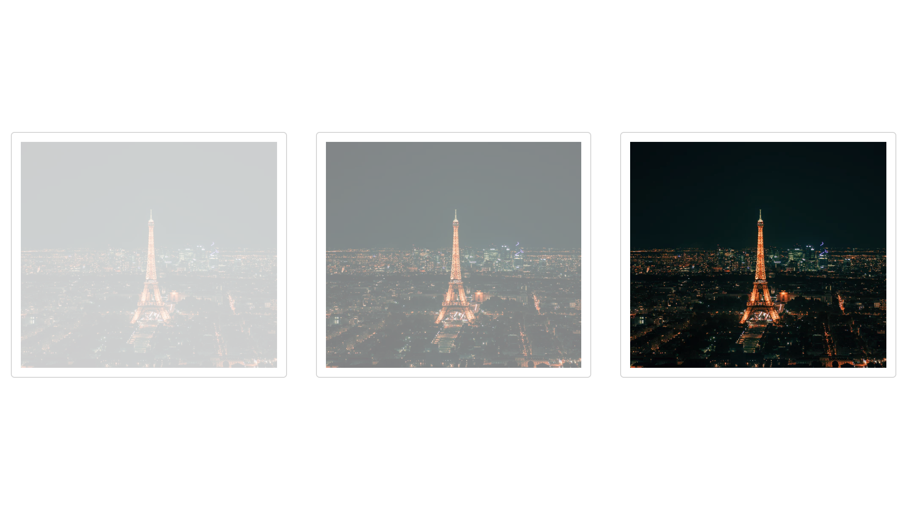
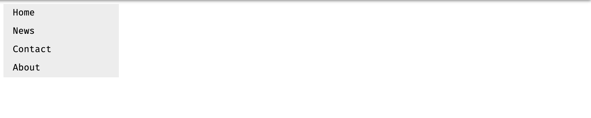
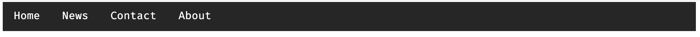

# Build a personal website with HTML and CSS

**Note:** Facilitators should teach the following concepts and could combine them to build a simple website. At the end of this class, students are expected to apply the knowledge received to build a personal website with HTML and CSS only.

## Images
### How to insert an image

```html

```

Attributes

> **src** -  specifies the URL (web address) of the image.
> **alt** - specifies an alternate text for an image.
> **height**  - specifies the height of an image.
> **width** - specifies the width of an image.

**Note:** The height and the width attributes can be applied with css.


### Styling Images with CSS

**Rounded Image**


```css
img {
	border-radius: 8px; 
}
```

To make your image a perfect circle - make the border radius 50%.


```css
img {
	border-radius: 50%; 
}
```

* Thumbnail image


Use the border property to create thumbnail images.

```css
img {
	border: 1px solid #ddd;
	border-radius: 4px;
	padding: 5px;
	width: 150px;
}
```

```html

```

### Centering an Image
To center an image within the page, make the image a block element and set the margin-left and margin-right to auto:

```css
img {
	display: block;
	margin-left: auto;
margin-right: auto;
}
```

### Transparent Images


The opacity property can take a value from 0.0 - 1.0. The lower value, the more transparent:

```css
img {
	opacity: 0.5;
}
```

### Menus
A menu ( or navigation bar) is basically a set of links, so using the <ul> and <li> elements makes perfect sense.

#### A simple Navigation Bar

```html
<ul>
  <li><a href="default.asp">Home</a></li>
  <li><a href="news.asp">News</a></li>
  <li><a href="contact.asp">Contact</a></li>
  <li><a href="about.asp">About</a></li>
</ul>
```

Now, lets remove the bullets and the margin and padding from the list. Add the following CSS code

```css
ul {
	list-style-type: none;
	margin: 0;
	padding: 0;
}
```

`list-style-type: none;` - Removes the bullets. A navigation bar does not need list markers
Set `margin: 0;` and `padding: 0;` to remove browser default settings.

### Vertical Navigation Bar
To build a vertical navigation bar, you can style the <a> elements inside the list, in addition to the code above.

```css
li a {
	display: block;
	width: 60px;
}
```

`display: block;` - Displaying the links as block elements makes the whole link area clickable (not just the text), and it allows us to specify the width (and padding, margin, height, etc. if you want).
`width: 60px;` - Block elements take up the full width available by default. We want to specify a 60 pixels width.

### Example: Vertical Navigation Bar
Create a basic vertical navigation bar with a gray background color and change the background color of the links when the user moves the mouse over them:



```css
ul {
	list-style-type: none;
	margin: 0;
	padding: 0;
	width: 200px;
	background-color: #f1f1f1;
}

li a {
	display: block;
	color: #000;
	padding: 8px 16px;
	text-decoration: none;
}

/* Change the link color on hover */
li a:hover {
	background-color: #555;
	color: white;
}
```

### Active / Current Navigation Link
Add an active class to the current link to let the user know which page he/she is on:

```css
.active {
	background-color: #4CAF50;
	color: white;
}
```

### Full Height Fixed Vertical NavBar
To create a full-height, sticky side navigation. Add the following css:

```css
ul {
	list-style-type: none;
	margin: 0;
	padding: 0;
	width: 25%;
	background-color: #f1f1f1;
	height: 100%; /* Full height */
	position: fixed; /* Make it stick, even on scroll */
	overflow: auto; /* Enable scrolling if the sidenav has too much content */
}
```

### Horizontal Navigation Bar
There are two (2) ways to create a horizontal navigation bar. Using inline or floating list elements.

* Inline List Elements

```css
li {
	display: inline;
}
```

`display: inline;` - By default, <li> elements are block elements. Here, we remove the line breaks before and after each list item, to display them on one line.

* Floating List Elements
Another way of creating horizontal navigation bar is to float the <li> elements, and specify a layout for the navigation links:

```css
li {
	float: left;
}

a {
	display: block;
	padding: 8px;
	background-color: #dddddd;
}
```

`float: left;` - use float to get block elements to slide next to each other
`display: block;` - Displaying the links as block elements makes the whole link area clickable (not just the text), and it allows us to specify padding (and height, width, margins, etc. if you want)
`padding: 8px;` - Since block elements take up the full width available, they cannot float next to each other. Therefore, specify some padding to make them look good
`background-color: #dddddd;` - Add a gray background-color to each a element

*Note: Add the background color to ul instead of <a> element if you want a full-width background color.*

### Example: Horizontal Navigation Bar
Create a basic horizontal navigation bar with a dark background color and change the background color of the links when the user moves the mouse over them:



```css
ul {
	list-style-type: none;
	margin: 0;
	padding: 0;
	overflow: hidden;
	background-color: #333;
}

li {
	float: left;
}

li a {
	display: block;
	color: white;
	text-align: center;
	padding: 14px 16px;
	text-decoration: none;
}

/* Change the link color to #111 (black) on hover */
li a:hover {
	background-color: #111;
}
```

You can add an active class to let the user know which page he/she is on:

```css
.active {
	background-color: #4CAF50;
}
```

### Right Align Links
You can make the links aligned to the right by floating the list items to the right (`float:right;`)

### Fixed Navigation Bar
Make the navigation bar stay at the top or bottom of the page even when the user scrolls the page:

* Fixed - Top
```css
ul {
	position: fixed;
	top: 0;
	width: 100%;
}
```

* Fixed - Bottom
```css
ul {
	position: fixed;
	bottom: 0;
	width: 100%;
}
```

### Multiple Pages
Hyperlinks is the key to creating multiple pages in HTML.

### HTML Links - Syntax

```html
<a href="url">link text</a>
```

### Absolute Links
An absolute link is a hyperlink containing a full url, which includes all the information needed to find a particular site, page or document or other addressable item on the internet.

```html
<a href="https://www.facebook.com/">Facebook</a>
```

### Local Links
A Local link ( link to the same website ) is specified with a relative url.

```html
<a href="about.html">About</a>
```

### HTML Links - Image as a Link
It is also common to use images as links. Here is how:

```html
<a href="default.asp">
  
</a>
```

### HTML Link Colors
By default, a link will appear like this (in all browsers):

<ol>
  <li>An unvisited link is underlined and blue</li>
  <li>A visited link is underlined and purple</li>
  <li>An active link is underlined and red</li>
</ol>

You can change the default colors, by using stylesheet. For example: 

```css
a:link {
	color: green; 
	background-color: transparent; 
	text-decoration: none;
}
 
a:visited {
	color: pink;
	background-color: transparent;
	text-decoration: none;
}
 
a:hover {
	color: red;
	background-color: transparent;
	text-decoration: underline;
}
 
a:active {
	color: yellow;
	background-color: transparent;
	text-decoration: underline;
}
```

### HTML Links - Create a Bookmark
HTML Bookmarks are used to allow readers to jump to a specific part of a web page.
Bookmarks can be used if your web page is very long. To make a bookmark, you must first create the bookmark, then add a link to it. When the link is clicked, the page will scroll to the location of the bookmark.

**Example**
First, create a bookmark with the id attribute:

```html
<div id="about">I am a full stack web developer, song-writer and engineer. </div>
```

Then, add a link to the bookmark within the same page.

```html
<a href="#about">About</a>
```

### Additional Resources
Here are some relevant links to some online YouTube tutorials:

* [Create a simple personal resume website](https://www.youtube.com/watch?v=jJuHQNULXGs&list=PLsIkqR8inizt8SpD6utVTPhy8gFQzQNug&index=1)
* [How to make a personal website using HTML and CSS](https://www.youtube.com/watch?v=M5PHL9nRO4w&index=8&list=PLyZ-ywwliWiuv24S9XlpS1NcY-xpiGWVN)
